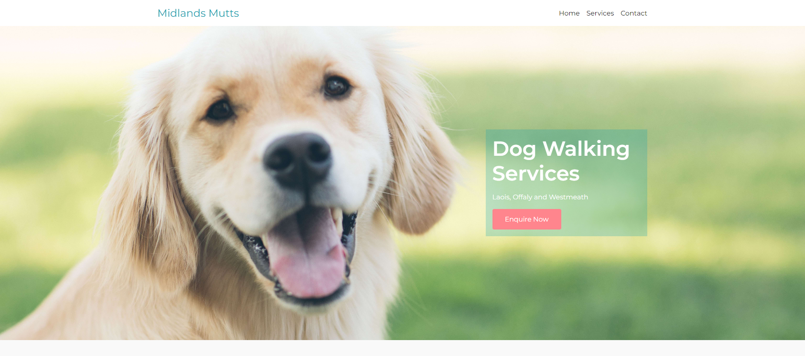
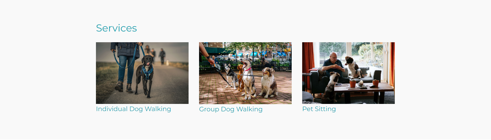
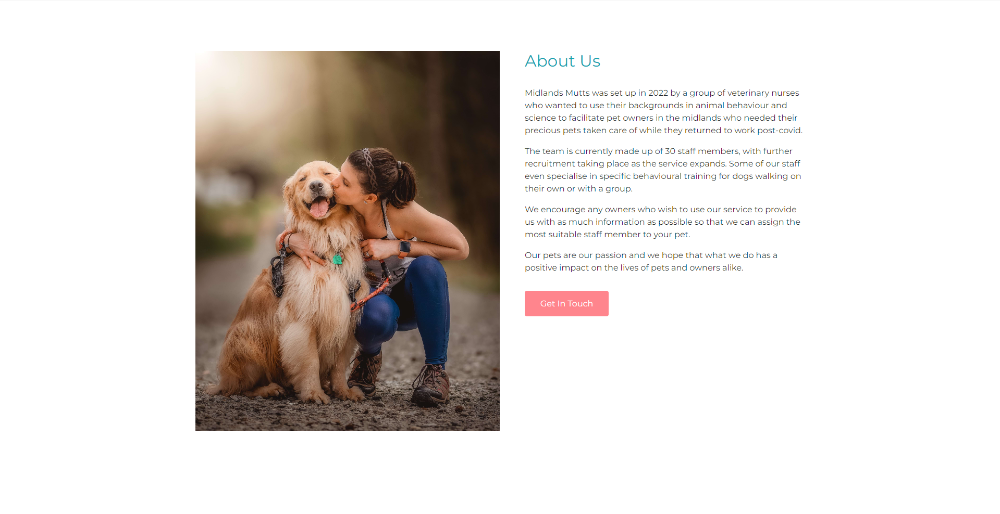
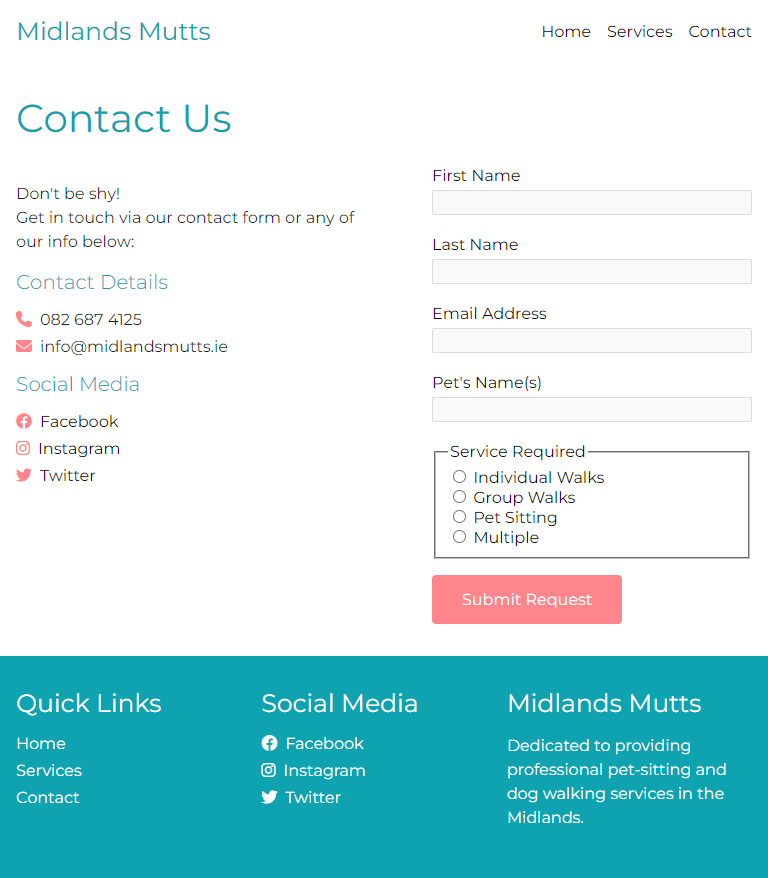
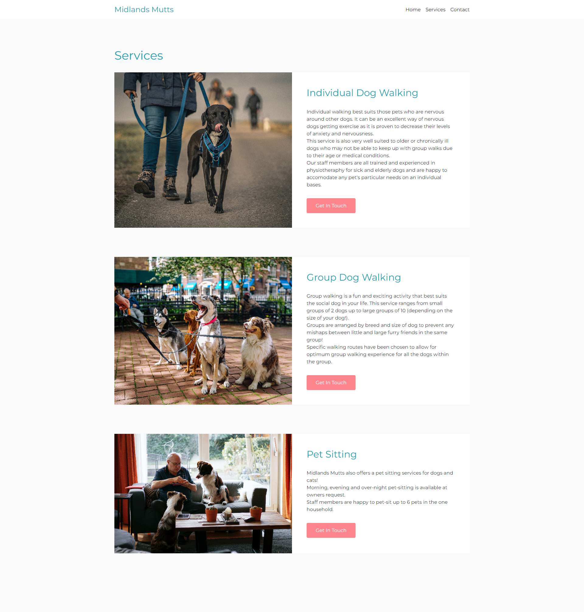
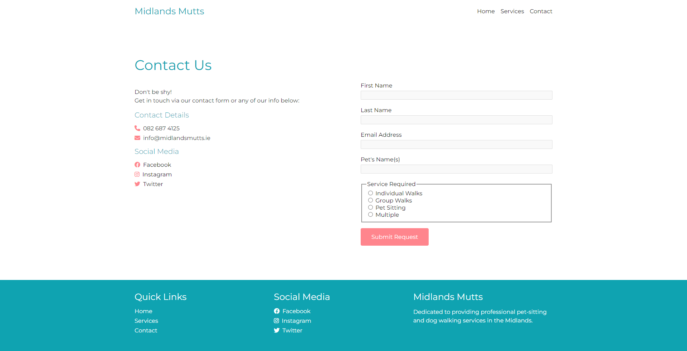
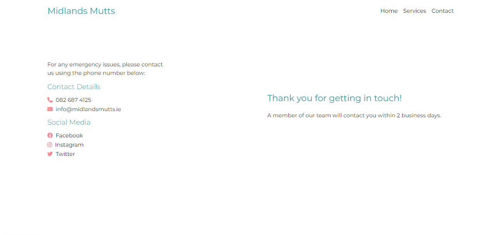

# Midlands Mutts

Midlands Mutts is a site providing information on dog-walking and pet-sitting services in the midlands area of Ireland. The site will be targeted towards pet-owners in the Midlands who require dog-walking and pet-sitting services, with the aim of them choosing this particular site.

 Midlands Mutts gives detailed information on the specific services offered, enabling the user to select the most appropriate service(s) for their pet. It will provide users with information on the service itself via the about section and it will enable the user to contact the page for more information via the contact form.

## Features

In this section, you should go over the different parts of your project, and describe each in a sentence or so. You will need to explain what value each of the features provides for the user, focusing on who this website is for, what it is that they want to achieve and how your project is the best way to help them achieve these things. (DELETE AFTERWARDS)

### Existing Features

* The Hero Image

    - Contains a picture of a happy dog with a text overlay displaying the services offered and the locations in which they are offered. 

* The Navigation Bar

    - Fully responsive navigation bar with clickable links to the logo, home page, services page and contact page. It's css remains the same for every page to allow for easy navigation.

    - This section will allow the user to easily navigate from page to page across all devices without having to revert back to the previous page via the ‘back’ button.

    

* Services Section

    - Allows the user to see the 3 services offered (individual dog walking, group dog walking and pet sitting) with attractive images depicting the services.

    - Images and text under each service are clickable and will link to the services page which will provide the user with further details on the services offerred.

    

* About Section

    - The about section will provide the user with information on how Midlands Mutts was set up and how it runs. This will assure the user that the services offered are by genuine, educated team members with the users pet's best interest at heart.

    - This section will be updated regularly to include any new information on staff and locations serviced to invite new users to use the service that may not have been available to them perviously.

    

* Contact Section
    
    - This section will enable the user to contact Midlands Mutts via the contact details and social media links on the left-hand-side of the section.

    - The right-hand side of this section contains the contact form. This will enable the user to enter their details and services they require which will then be submitted to a member of Midlands Mutts. 

    - Submission of the form will direct the user to a thank-you page.

    - The site's contact details and social media links all in the same section to provide the user with maximum contact options.

    

* Footer

    - This section contains clickable links that will direct the user to the top of the home, services and contact page. 

    - This section contains clickable links to Midlands Mutts social media sites.

    - All clickable links will open in a new tab to allow easy user navigation.

    - This section also contains a blurb about Midlands Mutts, which will provide the user with precise information on who Midlands Mutts are and what they do.  

    

* Services Page

    - The services page will provide the user with a full detailed description of the services offered, enabling them to decide which service suits them best.

    

* Contact Page

    - A page containg just the contact details and contact form, providing users will all the possible contact options they could have in one place.

    

* Thank You Page

    - A page that will only appear after the form has been submitted.
    It will display a polite thank-you message with an estimated time of reply. This will provide the user with useful information on when to expect a reply.

    - It also shows a message encouraging users to use specific contact details for any pet-emergencies. 

    

### Potential Features to Add

* A testimonial section with reviews from other useres of the site to encourage new users to contact Midlands Mutts.

## Design

### Website Comparisons

The following websites with the same theme as Midlands Mutts were examined for layout and content ideas:

- [Sit Stay Play](https://www.sitstayplayla.com/)
- [Manymutts](https://manymutts.com/)
- [Trusted House Sitters](https://www.trustedhousesitters.com/)

### Images

All images were sourced from [Unsplash](https://unsplash.com/) to add high-quality images that are relevant to each section.

### Fonts

Fonts were chosen using [Google Fonts](https://fonts.google.com/)

Montserrat was chosen as the main font, with helvetica and sans-serif set as the alternatives.
These fonts were chosen due to their popularity amongst a variety of websites.

### Colour Scheme

Colour scheme was selected using [Coolors](https://coolors.co/)

The 5 colours used were:
 - `#FFFFFF`
 - `#FF858D`
 - `#0FA3B1`
 - `#F9F9F9`
 - `#181D27`

 ### Wireframes

 - 
 - 
 - 
 - 

## Testing

### Valadator Testing

* HTML
    - HTML was tested with [W3C Markup Validation Service](https://validator.w3.org/)
    - Initial testing showed that alt attributes were missing from image tags.
    - Once the alt attributes were added, final testing returned 0 errors.

* CSS
    - CSS was tested with [W3C CSS Validation Service](https://jigsaw.w3.org/css-validator/)
    - 0 errors returned.

* Lighthouse
    - Initial testing in lighthouse showed poor performance of 46 due to image dimensions.
    - Once dimensions were reduced, performance improved dramatically. 
    - [Lighthouse results](./assets/read-me-images/Lighthouse%20Report.png)

### Browser Display

The completed site displays correctly on Google Chrome, Microsoft Edge and Safari browsers.

### Screen Sizes

The completed site displays correctly on a variety of screen sizes, including decktop, tablet, iphone and Samsung phones.
- [Desktop Display](./assets/read-me-images/home-desktop-about.png)
- [Tablet Display](./assets/read-me-images/home-tablet-hero.png)
- [Mobile Display](./assets/read-me-images/home-mobile.png)

## Technologies Used

### Languages Used
* HTML5
* CSS3

### Frameworks, Libraries & Programs Used

Bootstrap 4.4.1:
Bootstrap was used to assist with the responsiveness and styling of the website.
Hover.css:
Hover.css was used on the Social Media icons in the footer to add the float transition while being hovered over.
Google Fonts:
Google fonts were used to import the 'Titillium Web' font into the style.css file which is used on all pages throughout the project.
Font Awesome:
Font Awesome was used on all pages throughout the website to add icons for aesthetic and UX purposes.
jQuery:
jQuery came with Bootstrap to make the navbar responsive but was also used for the smooth scroll function in JavaScript.
Git
Git was used for version control by utilizing the Gitpod terminal to commit to Git and Push to GitHub.
GitHub:
GitHub is used to store the projects code after being pushed from Git.
Photoshop:
Photoshop was used to create the logo, resizing images and editing photos for the website.
Balsamiq:
Balsamiq was used to create the wireframes during the design process.

Hover.css
Google Fonts
- Used to import selected fonts into style.css file.
Font Awesome
- Used to add icons to contact info and social media links.
Git
Github
Balsamiq
- Used to create wireframes for site prior to coding.
Unsplash
- Used to select high-quality, relevant images for the site that were free from copyright.
Coolers
- Used to select an aesthetically pleasing colour pallet used throughout the site.

## Deployment

This section should describe the process you went through to deploy the project to a hosting platform (e.g. GitHub)

* The site was deployed to GitHub pages. The steps to deploy are as follows:
- In the GitHub repository, navigate to the Settings tab
- From the source section drop-down menu, select the Master Branch
- Once the master branch has been selected, the page will be automatically refreshed with a detailed ribbon display to indicate the successful deployment.

The live link can be found here - https://code-institute-org.github.io/love-running-2.0/index.html

## Credits

In this section you need to reference where you got your content, media and extra help from. It is common practice to use code from other repositories and tutorials, however, it is important to be very specific about these sources to avoid plagiarism.

You can break the credits section up into Content and Media, depending on what you have included in your project.

### Content

* 
* 
* 

### Media

* 
* 